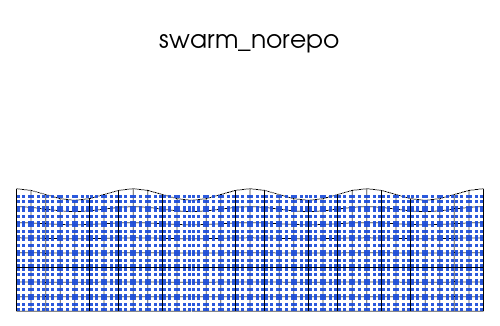
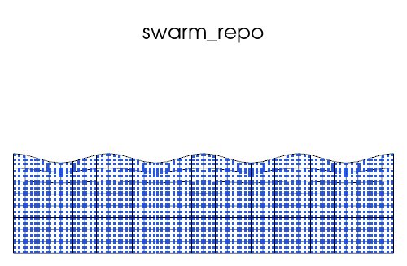
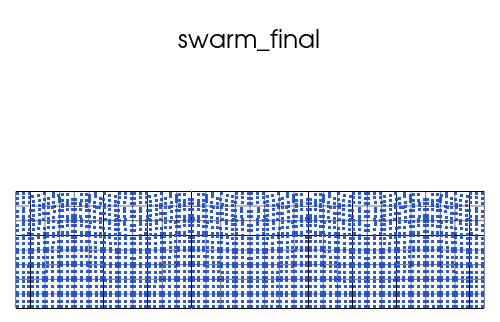
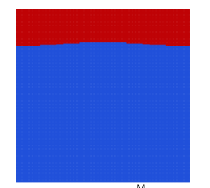

# Freesurface modelling examples

### TODO

- [x] Free surface (ALE) implemenation in uw3, Test cases (in parallel):

    - Topography relaxation model (Turcotte & Schubert, 2002)
    - RTI model (Kaus et.al., 2010)
    - Case 1 (Crameri et al., 2012)

- [x] Marker chain method 

- [x] Marker chain method with free surface 

- [ ] Level set method 

### Method
### Free surface (ALE)

1.Mesh Deform for free surface

The Arbitrary Lagrangian–Eulerian formulation is adapted here to simulate the free surface. In general, the mesh is regridding to fit the free surface with the following steps (Thieulot, 2011):

- free surface advection
    
    The top row mesh points are the discrete free surface of the domain. They will be advected by the Eulerian velocity:

  $$r(t+dt)=r(t)+v_i(t)\cdot dt \quad i=1,.....,nnx$$

- free surface resample
  
    We use a Clough-Tocher scheme to resample the free surface between $x = 0$ and $x = L_x$ as the grid points position is fixed at these locations.

- mesh regridding
  solving the Poisson equation to get a uniform distribution of the mesh vertical coordinates:

  $$\nabla^2\varphi = f$$

  Where f = 0, and the boundary conditions are applied is a Dirichlet constraint and defines that the top is the updated free surface, bottom is the original mesh bottom.

2.Swarm repopulate (similar to Ben's PopControl.redistribute())
- update the the swarm's owning cell
- add particles to the underpopulated_cells from the new swarm build on the deformed mesh
- delete particles from the overpopulated cells that are the closest to the cell centroids (random in redistribute)

### Level set method

### Marker chain method

### Result

1. Topography relaxation model 

   
   
   
   

Loading and unloading of a viscous half-space. see the similar case in uw2: [ViscoElasticHalfSpace](https://github.com/underworldcode/underworld2/blob/master/docs/UWGeodynamics/examples/1_08_ViscoElasticHalfSpace.ipynb)

Loading of Earth's surface can be described with an initial periodic surface displacement of a viscous fluid within an infinite half space, the solution of which is outlined in Turcotte and Schubert (1982), 6.10 Postglacial Rebound.  The surface decreases exponentially with time and is dependent on the magnitude, $w_m$, and wavelength $\lambda$ of the perturbation, and the viscosity, $\eta$ and density, $\rho$ of the fluid,

$$ w = w_m exp\Big(\frac{-\lambda \rho g t}{4\pi\eta}\Big) $$

where $w$ is displacement, $w_m$ the initial load magnitude, $g$ gravity, $t$ time. This solution can be characterised by the relaxation time, $t_{relax} = 4\pi\eta / \rho g \lambda $, the time taken for the initial load to decrease by $e^{-1}$. The solution for an elastic material with the equivalent load produces the same magnitude of displacement instantaneously.

### 2. RTI model

   

Rayleigh–Taylor instability ofadense,moreviscous layer ($\rho = 3300 kg/m^3$, $\eta = 10^{21} Pa s$), sinkingthrougha less densefluid ($\rho = 3200 kg/m^3$, $\eta = 10^{20} Pa s$). Side boundaries are free slip, the lower boundary is no-slip and the upper boundary is a free surface. The box is 500 × 500 km in size, and gravitational acceleration was 9.81 $m/s^2$. The initial perturbation was sinusoidal with an initial amplitude of 5 km. A constant time step of 2500 years was employed, with Q1P0 elements and 51×51 nodes.

### 3. Case 1 (Crameri et al., 2012)

The topography relaxation model is the same as case 1 from (Crameri et al., 2012) which is used here to validate the free surface implementation. The model setups are shown in Fig 1. It has a 600 km thick mantle, overlain by a 100 km thick lithosphere with a prescribed 7km amplitude cosine topography. The model box are 2800 km * 700 km, is caluated by the resolution of 280 × 140 gridpoints with 9 particles per element.

The maximum topography of this model at time t can be derived analytically (Ramberg, 1967) using the relaxation rate γ and from the initial maximum topography:

$$h_{analytic} = h_{init} exp(\gamma t)$$

where t = 14.825 ka is the characteristic relaxation time and $\gamma$ = −0.2139×10−11 s−1 is the characteristic relaxation rate.

### Reference
- Thieulot, C. (2011). FANTOM: Two-and three-dimensional numerical modelling of creeping flows for the solution of geological problems. Physics of the Earth and Planetary Interiors, 188(1-2), 47-68.
- Kaus, B. J., Mühlhaus, H., & May, D. A. (2010). A stabilization algorithm for geodynamic numerical simulations with a free surface. Physics of the Earth and Planetary Interiors, 181(1-2), 12-20.
- Turcotte, D. L., & Schubert, G. (2002). Geodynamics. Cambridge university press.
